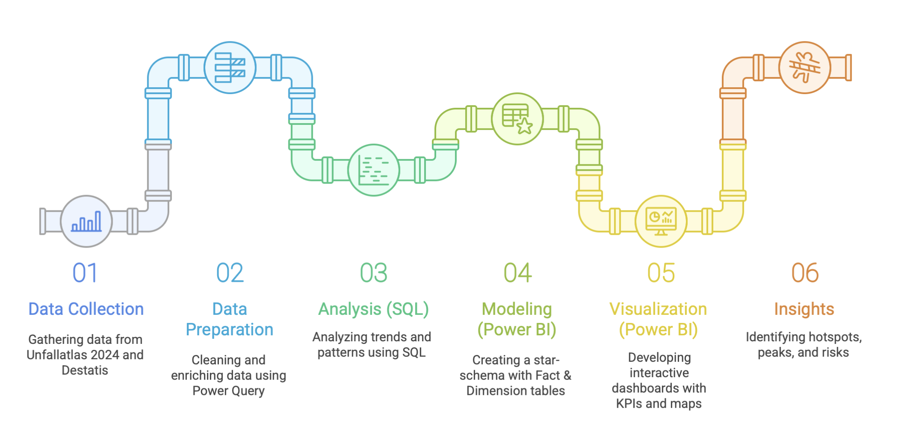

# Bavaria Traffic Accidents (2024) — SQL / Power BI Portfolio Project
*A full-stack data analysis project exploring accident patterns in Bavaria using open government data (Unfallatlas 2024).*
This project takes the 2024 Bavaria accident dataset and turns it into a structured SQL + Power BI analysis pipeline.
It demonstrates end-to-end skills in:

- Data engineering (cleaning, enrichment, modeling)
- SQL analysis (querying patterns by time, region, severity, and participants)
- Data visualization (interactive Power BI dashboards for insights)

The final dashboard is designed to be clear enough for decision makers and detailed enough for analysts.

---

## Pipeline (at a glance)

---

## Key Findings
	•	🚗 Cars dominate, but bicycles form a significant share in urban areas
	•	⏰ Rush hours (7–9 & 16–19) drive weekday accidents
	•	🌍 Upper Bavaria (esp. Munich) is the hotspot region
	•	🌙 Accidents in darkness/slippery roads have higher severity
	•	📉 Clear seasonality: summer peaks, winter lows
  
---
## 📊 Data
- Unfallatlas 2024 (Bavaria subset, CSV format)  
- District/region lookup from Destatis AGS
- See [`docs/DATA_SOURCES.md`](docs/DATA_SOURCES.md) for licensing  

---

## 📄 License
- Code: MIT (see `LICENSE`)  
- Data: dl-de/by-2-0 (attribution required)
